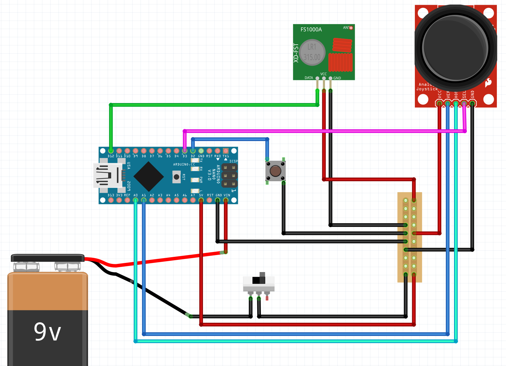

# Fjarstýring - Þrívíddarhönnun

Í þessu verkefni ætlar þú að hanna hulstu (e. casing) fyrir fjarstýringuna sem þú notar til að stýra bílnum sem þú hefur verið að gera á önninni.

## Þrívíddarhönnun með Tinkercad

- Byrjaðu á að búa þér til reikning á [Tinkercad síðunni](https://www.tinkercad.com/join) (veldu *Create a personal account*).
- Smelltu svo [hér](https://www.tinkercad.com/learn/project-gallery;collectionId=OPC41AJJKIKDWDV) og gerðu smáverkefnin sem eru á þeirri síðu, hvert og eitt ætti að taka 1 til 2 mínútur. Í þeim lærir þú flestar af þeim megin aðgerðum sem þú þarft að kunna til að hanna í þrívídd með Tinkercad.
- Kennarinn mun svo sýna tvær aðgerðir til vibótar.
  - Unnið með mismunandi vinnufleti (e. workplane).
  - Speglun hluta.

### Æfingaverkefni í þrívíddarteikningu

Gerðu hulstur (e. casing) utan um Arduino Uno stýritölvuna þína. Hafðu eftirfarandi í huga:
- Hafðu hulstrið mátulega stórt. Stýritölvan þarf að komast í hulstrið en þú villt ekki hafa meira en kannski 2 - 3 millimetra af tómu rými í kringum hana.
- Þú þarft að geta stungið USB snúru og aflsnúru í samband við stýritölvuna þegar hún er í hulstrinu.
- Þú finnur þrívíddarteiknaðan Arduino Uno í réttum málum í Tinkercad (í *Electronics*).
- Hafðu ytra byrði hulstursins þannig að þægilegt sé að halda á því, engin hvöss horn.

## Fjarstýring fyrir bílinn

Hannaðu fjarstýringu fyrir bílinn þinn. Með fjarstýringunni þarf að vera hægt að gera eftirfarandi aðgerðir á bílnum:
- Stjórna hraða, áfram, afturábak og stopp.
- Beygja til hægri og vinstri.
- Kveikja ljósin á bílnum.

Eftirfarandi íhlutir þurfa að vera í fjarstýringunni:
- Arduino Nano, þú finnur þrívíða mynd í réttum málum [hér](https://www.tinkercad.com/things/3odfSxmvepc-arduino-nano).
- Stýripinni, þú finnur þrívíða mynd í réttum málum [hér](https://www.tinkercad.com/things/jd5FgucYJ5k-joystickbutton).
- 9V rafhlaða, þú finnur þrívíða mynd í réttum málum í *Electronics* í Tinkercad.
- Eftirfarandi íhlutir sem ekki eru til þrívíðar myndir af. Þú þarft því að draga fram skíðmálið og mæla þá:
  - 433MHz sendirinn (ekki gleyma loftnetinu). 
  - Kveikja/Slökkva rofinn.
  - Takkinn til að kveikja á ljósunum.
- Snúrur til að tengja saman íhlutina.
- Veróborð fyrir jörð og 5V.

**Mikilvægt er að hafa eftirfarandi í huga við hönnun fjarstýringarinnar:**
- Fjarstýringin þarf að falla vel í hendi.
  - Hugsaðu um stærð hennar og að notendur hennar meiði sig ekki á henni (passa hvassar brúnir).
- Hafðu í huga hvernig snúrurnar eigi að komast frá einum íhlut til annars.
- Hnúðurinn á stýripinnanum ásamt tökkunum þarf að standa út úr hulstrinu.
- Vertu frumleg(ur) í hönnuninni.

### Tengimynd

Myndir sýnir hvernig íhlutirnir tengjast.

## Námsmat

Við mat á verkefninu verður horft til eftirfarandi þátta:
- Virkni (50%):
  - Komast allir íhlutirnir í fjarstýringuna?
    - Er gott skipulag á rýminu?
  - Er hugað að lagnaleiðum fyrir snúrur?
- Hönnun (50%):
  - Er hönnunin frumleg?
  - Liggur fjarstýringin vel í hendi?
  - Leggur þú eitthvað nýtt fram, eru notaðar aðferðir sem ekki hafa verið sýndar í tímanum?